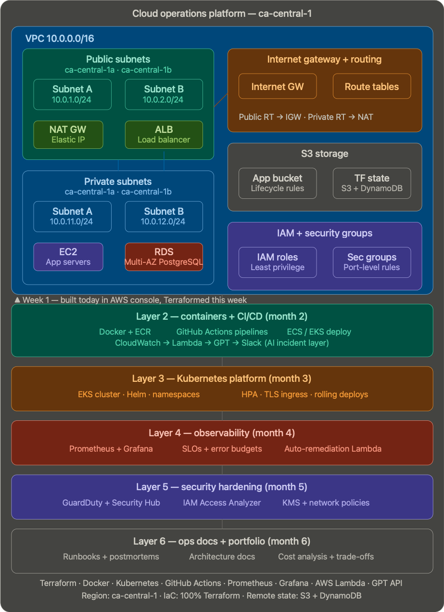

# Cloud Operations Platform

A production-grade cloud infrastructure platform built on AWS, designed to demonstrate end-to-end ownership of cloud infrastructure — from networking foundations to Kubernetes orchestration, CI/CD automation, observability, and AI-assisted incident response.

Built as part of a structured 6-month Cloud/DevOps transition, this platform represents the kind of system a Platform Engineering or SRE team would own and operate in a real production environment.

---

## Architecture overview



> Full diagram covers: VPC networking layer → compute and storage → containerised application → Kubernetes platform → CI/CD pipelines → observability stack → security controls → AI incident response.

---

## Platform layers

| Layer | Technology | Status |
| --- | --- | --- |
| Cloud infrastructure | AWS, Terraform | 🔨 In progress |
| Containers + CI/CD | Docker, GitHub Actions, ECR | ⬜ Month 2 |
| Kubernetes platform | EKS, Helm, kubectl | ⬜ Month 3 |
| Observability | Prometheus, Grafana, CloudWatch | ⬜ Month 4 |
| Security hardening | GuardDuty, IAM Analyzer, KMS | ⬜ Month 5 |
| Ops documentation | Runbooks, postmortems | ⬜ Month 6 |

---

## Infrastructure design (Month 1)

### VPC architecture

```
Region: ca-central-1

VPC CIDR: 10.0.0.0/16
├── Public Subnet A  (10.0.1.0/24)  — ca-central-1a  → Internet Gateway
├── Public Subnet B  (10.0.2.0/24)  — ca-central-1b  → Internet Gateway
├── Private Subnet A (10.0.11.0/24) — ca-central-1a  → NAT Gateway
└── Private Subnet B (10.0.12.0/24) — ca-central-1b  → NAT Gateway

Internet Gateway  → attached to VPC
NAT Gateway       → deployed in Public Subnet A
```

### Design decisions

**Why public and private subnets?**
Compute (EC2) and database (RDS) resources sit in private subnets with no direct internet exposure. Only the load balancer and NAT gateway reside in public subnets. This enforces least-privilege networking — a compromise of the application layer does not expose the data layer directly.

**Why NAT Gateway over NAT Instance?**
Managed availability, no patching overhead, and automatic scaling. In a production environment the operational cost of managing NAT instances outweighs the cost saving.

**Why two availability zones?**
High availability by default. RDS Multi-AZ and future EKS node groups require subnets in at least two AZs. Building this from day one avoids expensive refactoring later.

**Why ca-central-1?**
Canadian data residency compliance — relevant for any future work with Canadian financial institutions or regulated industries.

---

## Repo structure

```
cloud-ops-platform/
├── infra/
│   └── terraform/
│       ├── modules/
│       │   ├── networking/     ← VPC, subnets, IGW, NAT, route tables
│       │   ├── compute/        ← EC2, ASG, launch templates
│       │   ├── storage/        ← S3, RDS, lifecycle policies
│       │   ├── security/       ← IAM roles, security groups, KMS
│       │   └── monitoring/     ← CloudWatch alarms, SNS topics
│       └── envs/
│           ├── dev/
│           ├── staging/
│           └── prod/
├── app/                        ← Containerized application (Month 2)
├── platform/
│   └── k8s/                   ← EKS, Helm charts, namespaces (Month 3)
├── observability/              ← Prometheus, Grafana, alerting (Month 4)
├── security/                   ← GuardDuty, IAM Analyzer, policies (Month 5)
├── ops/
│   ├── runbooks/               ← Incident response procedures
│   └── postmortems/            ← Post-incident reviews
└── .github/
    └── workflows/              ← CI/CD pipelines (Month 2)
```

---

## Tech stack

**Cloud:** AWS (VPC, EC2, RDS, S3, EKS, Lambda, CloudWatch, GuardDuty, Security Hub)

**Infrastructure as Code:** Terraform (modular, remote state via S3 + DynamoDB locking)

**Containers:** Docker, Amazon ECR

**Orchestration:** Kubernetes (EKS), Helm

**CI/CD:** GitHub Actions

**Observability:** Prometheus, Grafana, CloudWatch, SNS

**Security:** GuardDuty, IAM Access Analyzer, KMS, Security Hub

**AI layer:** AWS Lambda + GPT API — AI-powered incident summariser (CloudWatch → Lambda → GPT → Slack)

---

## Key engineering decisions

**Infrastructure as Code from day one**
Every resource is defined in Terraform. No manual console changes after initial setup. This ensures reproducibility, auditability, and the ability to spin up identical environments for dev/staging/prod.

**Remote state with locking**
Terraform state stored in S3 with DynamoDB locking. Prevents concurrent state corruption and enables team collaboration.

**Modular Terraform structure**
Each infrastructure concern (networking, compute, storage, security, monitoring) is a reusable module. Environments (dev/staging/prod) call these modules with different variable sets — one change to a module propagates consistently.

**Observability as a first-class concern**
Prometheus and Grafana deployed alongside the application, not as an afterthought. SLOs and error budgets defined before incidents happen.

**AI-augmented operations**
CloudWatch log anomalies are processed by a Lambda function that calls the GPT API to generate human-readable incident summaries and suggested remediation steps, delivered to Slack. Reduces mean time to diagnosis without requiring an engineer to parse raw logs at 2am.

---

## Running locally

```bash
# Clone the repo
git clone https://github.com/[your-username]/cloud-ops-platform.git
cd cloud-ops-platform

# Initialise Terraform (Month 1)
cd infra/terraform/envs/dev
terraform init
terraform plan
terraform apply
```

**Prerequisites:** AWS CLI configured, Terraform >= 1.6, kubectl (Month 3+)

---

## Build log

| Week | What was built | Commit |
|---|---|---|
| Week 1 | Repo structure, VPC manual build in AWS console | — |
| Week 2 | VPC + EC2 + RDS deployed via Terraform | — |
| Week 3 | Terraform modules, remote state | — |
| Week 4 | IAM roles, CloudWatch alarms, bash health check | — |

---

## About this project

This platform is being built as part of a 6-month structured transition into Cloud/DevOps engineering. Every layer reflects real production patterns, not tutorial reproductions — design decisions, trade-offs, and failure scenarios are documented throughout.

**Target roles:** Cloud Engineer · DevOps Engineer · Platform Engineer · SRE

**LinkedIn:** [your-linkedin-url]

---

*Last updated: April 2026*
