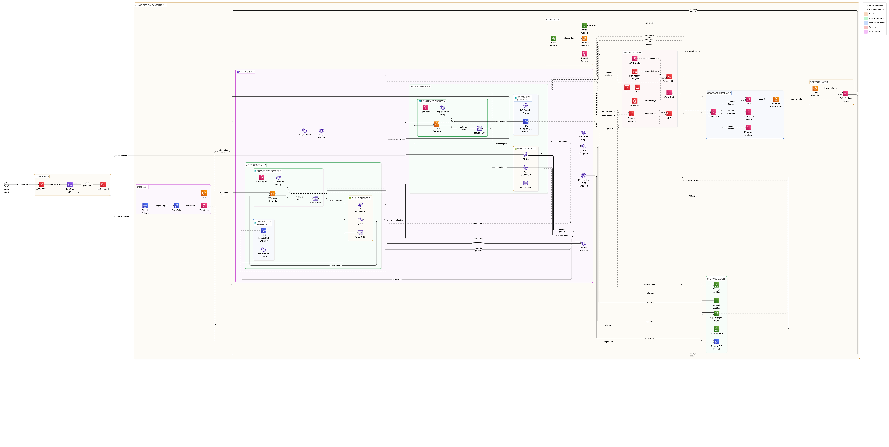

# Cloud Operations Platform

> A production-grade cloud infrastructure platform built on AWS — designed and operated against all six pillars of the [AWS Well-Architected Framework](https://aws.amazon.com/architecture/well-architected/).

Built as part of a structured 6-month Cloud/DevOps transition project, this platform represents the kind of system a Platform Engineering or SRE team would own and operate in a real production environment. Every architectural decision is documented with its Well-Architected rationale so the platform serves as both working infrastructure and a learning artefact.

**Author:** Juwon &nbsp;·&nbsp; **Region:** ca-central-1 &nbsp;·&nbsp; **Started:** April 2026

---

## Architecture diagram

> Full platform target state. Services are activated progressively across 6 months. See [build log](#build-log) for current status per service.



*Diagram generated with [Eraser.io](https://eraser.io)*

> Full diagram covers: VPC networking layer → compute and storage → containerised application → Kubernetes platform → CI/CD pipelines → observability stack → security controls → AI incident response.

**Layers visible in the diagram:**

| Layer | Location in diagram | Month |
|---|---|---|
| Edge (WAF · CloudFront · Shield) | Far left | Month 1 |
| IaC (GitHub Actions · CodeBuild · Terraform) | Left panel | Month 1–2 |
| VPC · AZ-A · AZ-B · Subnets · IGW · NAT GW | Centre | Month 1 |
| Security (IAM · KMS · GuardDuty · Security Hub) | Right panel | Month 1 + 5 |
| Observability (CloudWatch · Grafana · Lambda) | Far right | Month 4 |
| Cost (Budgets · Cost Explorer · Optimizer) | Top right | Month 1 |
| Compute (Auto Scaling Group · Launch Template) | Top far right | Month 1–2 |
| Storage (S3 · RDS Backup · DynamoDB) | Bottom right | Month 1 |

---

## Platform layers

| Layer | Technology | Status |
|---|---|---|
| Cloud infrastructure | AWS · Terraform | 🔨 In progress |
| Containers + CI/CD | Docker · GitHub Actions · ECR | ⬜ Month 2 |
| Kubernetes platform | EKS · Helm · kubectl | ⬜ Month 3 |
| Observability | Prometheus · Grafana · CloudWatch | ⬜ Month 4 |
| Security hardening | GuardDuty · IAM Analyzer · KMS | ⬜ Month 5 |
| Ops documentation | Runbooks · postmortems | ⬜ Month 6 |

---

## Infrastructure design — Month 1

### VPC architecture

```
Region: ca-central-1

VPC CIDR: 10.0.0.0/16
├── Public Subnet A  (10.0.1.0/24)  — ca-central-1a  → Internet Gateway
├── Public Subnet B  (10.0.2.0/24)  — ca-central-1b  → Internet Gateway
├── Private App A    (10.0.11.0/24) — ca-central-1a  → NAT Gateway A
├── Private App B    (10.0.12.0/24) — ca-central-1b  → NAT Gateway B
├── Private Data A   (10.0.21.0/24) — ca-central-1a  → RDS Primary
└── Private Data B   (10.0.22.0/24) — ca-central-1b  → RDS Standby (Multi-AZ)

Internet Gateway  → attached to VPC · single controlled entry/exit point
NAT Gateway A     → deployed in Public Subnet A · Elastic IP
NAT Gateway B     → deployed in Public Subnet B · Elastic IP (AZ-B failover)
```

### Design decisions

**Why public and private subnets?**
Compute (EC2) and database (RDS) resources sit in private subnets with no direct internet exposure. Only the ALB and NAT gateways reside in public subnets. This enforces least-privilege networking — a compromise of the application layer does not expose the data layer directly.

**Why NAT Gateway over NAT Instance?**
Managed availability, no patching overhead, and automatic scaling. In a production environment the operational cost of managing NAT instances outweighs the cost saving. AWS-managed means AWS is responsible for HA, not you.

**Why a NAT Gateway per AZ?**
A single NAT Gateway is a single point of failure for all outbound private traffic. If AZ-A fails and the NAT Gateway lives there, everything in AZ-B loses internet connectivity. Per-AZ NAT Gateways are an AWS Well-Architected best practice for reliability. Cost: ~$33 CAD/month each — the primary infrastructure cost of this design.

**Why two availability zones from day one?**
High availability by default. RDS Multi-AZ and future EKS node groups require subnets in at least two AZs. Building this correctly from day one avoids expensive VPC refactoring when these services are added later.

**Why ca-central-1?**
Canadian data residency compliance — relevant for any future work with Canadian financial institutions, healthcare organisations, or regulated industries. Avoids a costly region migration later.

**Why deliberate CIDR gaps?**
Public `10.0.1-2.x`, private app `10.0.11-12.x`, private data `10.0.21-22.x`. The gaps between ranges allow future subnets to be added without renumbering — a common and expensive mistake to fix retroactively.

---

## Well-Architected Framework alignment

This platform is designed and evaluated against all six pillars of the AWS Well-Architected Framework. Every AWS service maps to at least one pillar — this section documents the rationale.

---

### Pillar 1 — Operational Excellence

> *Run and monitor systems effectively. Gain insight into operations. Continuously improve processes and procedures.*

**Core principle: perform all operations as code — nothing manual after the initial console build.**

Every resource is defined in Terraform. GitHub Actions runs lint → plan → apply on every push to `main`. No engineer touches the AWS console for infrastructure changes after Week 2.

| Service | Role |
|---|---|
| **Terraform** | All infrastructure as code — reproducible across dev / staging / prod |
| **GitHub Actions** | CI/CD pipeline — automated lint, plan, apply, deploy |
| **CodeBuild** | Executes Terraform plan inside the pipeline — no local state |
| **Systems Manager** | Session Manager replaces SSH — every session logged, no key management |
| **CloudTrail** | Every AWS API call recorded — tamper-proof, stored in dedicated S3 bucket |
| **VPC Flow Logs** | All network traffic logged — shipped to S3, queryable via Athena |
| **CloudWatch** | Metrics, logs, alarms, dashboards — single operational pane of glass |
| **Managed Grafana** | Engineering dashboards — SLO tracking, resource utilisation |
| **AWS Config** | Drift detection — alerts when infrastructure deviates from Terraform state |

**Key decision — no SSH bastion:** Systems Manager Session Manager provides secure shell access controlled entirely by IAM. Port 22 is never open. Every session is automatically logged in CloudTrail. Zero key management overhead.

---

### Pillar 2 — Security

> *Protect data, systems, and assets. Implement a strong identity foundation. Enable traceability. Apply security at every layer.*

**Core principle: defence in depth — independent security controls at edge, network, compute, and data layers.**

#### Network security

| Control | Layer | What it blocks |
|---|---|---|
| **AWS WAF** | Edge | SQL injection, XSS, rate-limit abuse |
| **AWS Shield Standard** | Edge | DDoS — automatic, free tier |
| **ACM (TLS certificates)** | Edge / ALB | All traffic HTTPS — free, auto-renewing |
| **Public NACLs** | Subnet | Deny all except port 80/443 — stateless first line |
| **Private NACLs** | Subnet | Block all inbound from internet at subnet level |
| **App Security Group** | Instance | Inbound port 443 from ALB security group **only** — not `0.0.0.0/0` |
| **DB Security Group** | Instance | Inbound port 5432 from app security group **only** |
| **VPC Endpoints (S3, DynamoDB)** | Network | Traffic to AWS services never traverses public internet |

#### Identity and access

| Control | What it enforces |
|---|---|
| **IAM least privilege** | Every role has only the permissions required for its specific function |
| **No root account usage** | Root access keys deleted · MFA enabled · root never used for operations |
| **IAM Access Analyzer** | Scans continuously for policies granting unintended public access |
| **IMDSv2 enforced** | Prevents SSRF-based EC2 credential theft via instance metadata |

#### Data protection

| Control | What is encrypted |
|---|---|
| **AWS KMS** | RDS storage · S3 (state + assets) · EBS volumes — customer-managed keys |
| **Secrets Manager** | DB credentials stored and auto-rotated every 30 days — never hardcoded |
| **S3 block public access** | Enforced at account level — no bucket ever accidentally made public |
| **RDS encryption** | Storage, automated backups, and snapshots all encrypted at rest |

#### Detection and response

| Service | Role |
|---|---|
| **GuardDuty** | ML-powered threat detection — unusual API calls, compromised credentials |
| **Security Hub** | Central findings aggregator — maps to CIS AWS Foundations Benchmark |
| **CloudTrail** | Immutable API audit log — MFA delete enabled on destination bucket |

---

### Pillar 3 — Reliability

> *Ensure a workload performs its intended function correctly and consistently. Recover quickly from failure. Meet demand.*

**Core principle: design for failure — assume components will fail, architect so they can.**

| Decision | Failure it prevents |
|---|---|
| **Two Availability Zones** | Platform survives complete failure of one AWS AZ |
| **NAT Gateway per AZ** | AZ-B retains outbound internet access if AZ-A fails entirely |
| **RDS Multi-AZ (Primary + Standby)** | Database survives primary failure — automatic failover under 2 minutes |
| **Auto Scaling Group (min:1, desired:2, max:4)** | Replaces unhealthy EC2 instances — maintains desired capacity automatically |
| **Cross-zone Application Load Balancer** | Routes traffic around unhealthy instances across both AZs |
| **AWS Backup** | Daily automated RDS snapshots — 7-day retention — encrypted |
| **Lambda auto-remediation** | CloudWatch alarm triggers Lambda to scale or restart before humans are paged |
| **S3 versioning** | Terraform state and app assets recoverable after accidental deletion |

---

### Pillar 4 — Performance Efficiency

> *Use resources efficiently. Maintain efficiency as demand and technology evolve.*

**Core principle: use managed services and deploy globally — let AWS manage the undifferentiated heavy lifting.**

| Service | Performance contribution |
|---|---|
| **CloudFront CDN** | Caches static assets at edge — reduces origin load and user latency globally |
| **Application Load Balancer** | Cross-zone distribution — prevents single-instance bottlenecks |
| **Auto Scaling Group** | Adds capacity when CPU/request thresholds breach — removes when demand drops |
| **VPC Gateway Endpoints** | S3 and DynamoDB via AWS backbone — bypasses NAT Gateway bottleneck entirely |
| **Compute Optimizer** | Analyses actual utilisation — surfaces right-sizing recommendations |
| **t3.micro (burstable)** | Right-sized for development phase — upgrade path to `m6i` or `c6i` when data supports it |

---

### Pillar 5 — Cost Optimisation

> *Avoid unnecessary costs. Understand spend. Select the most appropriate resources.*

**Core principle: implement cloud financial management — make spend visible before it becomes a problem.**

| Control | Cost impact |
|---|---|
| **AWS Budgets** | Alert at 80% of $50/month — prevents surprise bills during learning phase |
| **VPC Gateway Endpoints (S3 + DynamoDB)** | Eliminates NAT GW data charges for S3/DynamoDB ($0.045/GB saved) |
| **Auto Scaling (min:1 after hours)** | No idle compute cost outside development hours |
| **DynamoDB PAY_PER_REQUEST** | No provisioned capacity charges — pay only for actual reads/writes |
| **S3 Lifecycle to Glacier** | Logs archived after 90 days — ~80% storage cost reduction for cold data |
| **RDS db.t3.micro** | Qualifies for free tier — 750 hours/month for first 12 months |
| **Cost Explorer** | Weekly spend review — identifies anomalies before they accumulate |
| **Compute Optimizer** | Prevents over-provisioning — typically 25–30% waste reduction |
| **Trusted Advisor** | Free tier checks — surfaces cost optimisation opportunities automatically |

**Estimated monthly cost (Week 1 build):** $0–$5 CAD within free tier limits. Primary ongoing cost is NAT Gateway (~$33 CAD/month each × 2 = ~$66). During active development only, consider stopping NAT Gateways outside working hours to reduce this near zero.

---

### Pillar 6 — Sustainability

> *Minimise environmental impact. Maximise utilisation. Eliminate waste.*

**Core principle: right-size everything and prefer managed services.**

| Decision | Sustainability impact |
|---|---|
| **Auto Scaling (min:1 after hours)** | No idle EC2 instances consuming energy outside peak hours |
| **Compute Optimizer** | Eliminates over-provisioned resources — reduces energy per unit of work |
| **S3 Lifecycle to Glacier** | Stale data moved to lower-energy storage tier automatically |
| **Lambda for remediation** | Executes only when needed — no continuously running background server |
| **Shared RDS Multi-AZ** | One cluster for all environments — not one database per environment |
| **CloudFront caching** | Serves cached responses — reduces compute cycles at origin per request |
| **Managed services preference** | RDS, DynamoDB, ALB run at AWS fleet utilisation rates — more efficient than self-managed |
| **ca-central-1 region** | AWS committed to 100% renewable energy — Canada region aligned with this goal |

---

## Key engineering decisions

**Infrastructure as Code from day one**
Every resource is defined in Terraform. No manual console changes after the initial Week 1 build. This ensures reproducibility, auditability, and the ability to spin up identical environments for dev/staging/prod. The console is used to understand what is being built — Terraform owns the state from Week 2 onward.

**Remote state with locking**
Terraform state is stored in S3 with DynamoDB locking. Prevents concurrent state corruption when multiple engineers or pipeline runs execute simultaneously. Enables full team collaboration and state history.

**Modular Terraform structure**
Each infrastructure concern (networking, compute, storage, security, monitoring) is a reusable module. Environments (dev/staging/prod) call these modules with different variable sets — one change to a module propagates consistently across all environments.

**No SSH — Systems Manager only**
Port 22 is never open on any EC2 instance. All shell access is via AWS Systems Manager Session Manager, controlled by IAM policy and automatically logged in CloudTrail. Eliminates the attack surface and operational burden of SSH key management entirely.

**Observability as a first-class concern**
Prometheus and Grafana deployed alongside the application, not as an afterthought. SLOs and error budgets defined before incidents happen. CloudWatch alarms trigger auto-remediation via Lambda before humans are paged.

**AI-augmented operations**
CloudWatch log anomalies are processed by a Lambda function that calls the GPT API to generate human-readable incident summaries and suggested remediation steps, delivered to Slack. Reduces mean time to diagnosis without requiring an engineer to parse raw logs at 2am. Implemented in Month 2.

**Secrets Manager over environment variables**
Database credentials are never hardcoded or stored in environment variables. Secrets Manager stores them encrypted with KMS and rotates them automatically every 30 days. If a credential is compromised, rotation resolves it within the rotation window without any code change.

---

## Repo structure

```
cloud-ops-platform/
├── infra/
│   └── terraform/
│       ├── modules/
│       │   ├── networking/       ← VPC, subnets, IGW, NAT, NACLs, VPC flow logs
│       │   ├── compute/          ← EC2, ASG, launch templates
│       │   ├── storage/          ← S3, RDS, lifecycle policies, backup
│       │   ├── security/         ← IAM, KMS, Secrets Manager, GuardDuty
│       │   └── monitoring/       ← CloudWatch, alarms, SNS, Lambda
│       └── envs/
│           ├── dev/              ← Active environment
│           ├── staging/
│           └── prod/
├── app/                          ← Containerised application (Month 2)
├── platform/
│   └── k8s/                     ← EKS, Helm charts, namespaces (Month 3)
├── observability/                ← Prometheus, Grafana, alerting (Month 4)
├── security/                     ← GuardDuty, IAM Analyzer, policies (Month 5)
├── ops/
│   ├── runbooks/                 ← Incident response procedures
│   └── postmortems/              ← Post-incident reviews
├── docs/
│   ├── screenshots/week1/        ← AWS console screenshots
│   ├── Cloud-Ops_Architecture-Main.png  ← Architecture diagram
└── .github/
    └── workflows/                ← CI/CD pipelines (Month 2)
```

---

## Tech stack

**Cloud:** AWS (VPC, EC2, RDS, S3, EKS, Lambda, CloudWatch, GuardDuty, Security Hub)

**Infrastructure as Code:** Terraform — modular, remote state via S3 + DynamoDB locking

**Containers:** Docker, Amazon ECR

**Orchestration:** Kubernetes (EKS), Helm

**CI/CD:** GitHub Actions, AWS CodeBuild

**Observability:** Prometheus, Grafana, CloudWatch, SNS

**Security:** GuardDuty, IAM Access Analyzer, KMS, Secrets Manager, Security Hub, AWS WAF

**AI layer:** AWS Lambda + GPT API — AI-powered incident summariser (CloudWatch → Lambda → GPT → Slack)

---

## Running locally

```bash
# Clone the repo
git clone https://github.com/[your-username]/cloud-ops-platform.git
cd cloud-ops-platform

# Configure AWS credentials
aws configure
# Region: ca-central-1 | Output: json

# Verify connection
aws sts get-caller-identity

# Initialise Terraform (Week 2 — after console build)
cd infra/terraform/envs/dev
terraform init
terraform plan
terraform apply
```

**Prerequisites:** AWS CLI v2 configured · Terraform >= 1.6 · kubectl (Month 3+) · Docker (Month 2+)

---

## Build log

| Week | What was built | Method | Status |
|---|---|---|---|
| Week 1 | Repo structure · README · Well-Architected docs | Git | ✅ Done |
| Week 1 | Architecture diagram (Eraser.io · Well-Architected) | Eraser.io | ✅ Done |
| Week 1 | VPC · 4 subnets · IGW · NAT GW · Route tables | AWS Console | 🔨 In progress |
| Week 2 | Full VPC stack via Terraform modules | Terraform | ⬜ Upcoming |
| Week 2 | IAM roles · CloudWatch alarms | Terraform | ⬜ Upcoming |
| Week 3 | Terraform modules · remote state (S3 + DynamoDB lock) | Terraform | ⬜ Upcoming |
| Week 4 | Linux bash health check · Month 1 capstone | Bash | ⬜ Upcoming |

---

## Well-Architected resources

| Pillar | Official whitepaper |
|---|---|
| Framework overview | [aws.amazon.com/architecture/well-architected](https://aws.amazon.com/architecture/well-architected/) |
| Operational Excellence | [docs.aws.amazon.com](https://docs.aws.amazon.com/wellarchitected/latest/operational-excellence-pillar/welcome.html) |
| Security | [docs.aws.amazon.com](https://docs.aws.amazon.com/wellarchitected/latest/security-pillar/welcome.html) |
| Reliability | [docs.aws.amazon.com](https://docs.aws.amazon.com/wellarchitected/latest/reliability-pillar/welcome.html) |
| Performance Efficiency | [docs.aws.amazon.com](https://docs.aws.amazon.com/wellarchitected/latest/performance-efficiency-pillar/welcome.html) |
| Cost Optimization | [docs.aws.amazon.com](https://docs.aws.amazon.com/wellarchitected/latest/cost-optimization-pillar/welcome.html) |
| Sustainability | [docs.aws.amazon.com](https://docs.aws.amazon.com/wellarchitected/latest/sustainability-pillar/sustainability-pillar.html) |
| Well-Architected Tool (free) | [console.aws.amazon.com/wellarchitected](https://console.aws.amazon.com/wellarchitected) |

---

## About this project

This platform is being built as part of a structured 6-month transition into Cloud/DevOps engineering. Every layer reflects real production patterns, not tutorial reproductions — design decisions, trade-offs, and failure scenarios are documented throughout.

**Target roles:** Cloud Engineer · DevOps Engineer · Platform Engineer · SRE

**LinkedIn:** [JuwonAjana](https://www.linkedin.com/in/oluwajuwon-ajana/) &nbsp;·&nbsp; **GitHub:** [AjanaLarry](https://github.com/AjanaLarry)

---

*Last updated: April 2026 · Region: ca-central-1 · Built against AWS Well-Architected Framework (6 pillars)*